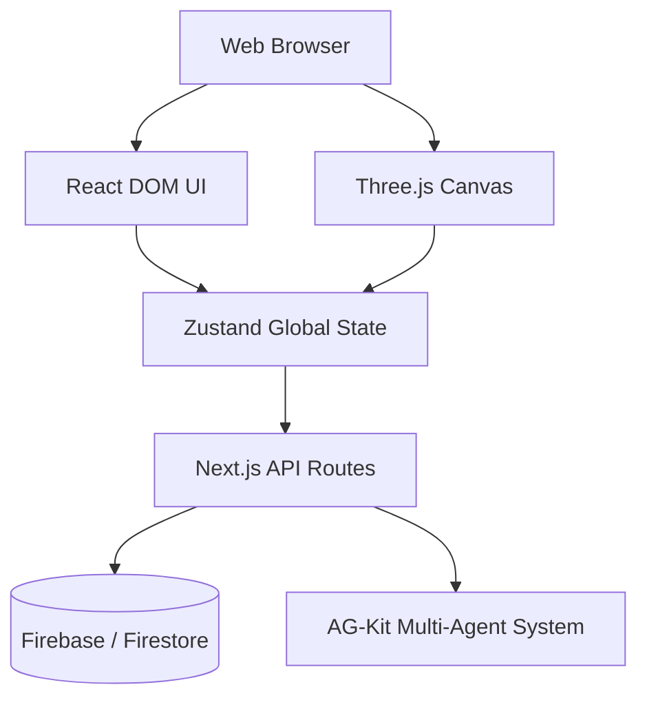

# System Architecture

> ClawClip represents a hybrid web application blending standard DOM-based UI (Next.js/React) with a WebGL 3D canvas layer (Three.js/R3F) for spatial context.

## 1. High-Level Architecture

## 2. Core Components

### 2.1 UI Layer (`paperclip/ui`)
- **Immersive Screens**: Full-screen modal panels taking over the UI (Kanban, Comms, Discover).
- **Bottom Dock**: Navigation bar for invoking immersive screens.
- **State Management**: `zustand` manages active panels, selected entities, and camera targets.

### 2.2 Spatial Engine (`Claw3D`)
- **Canvas Integration**: Renders underneath the DOM layer.
- **Isometric Projection**: Fixed orthographic camera (`x:0, y:12, z:18`).
- **Entity Sync**: Translates `workforce` JSON arrays into 3D sprite nodes on the floorplan grid.

### 2.3 Agent Subsystem (`ag-kit`)
- **Skills & MCP**: Model Context Protocol servers handle tool execution.
- **Persistent Memory**: Shared markdown context via `.agents/memory/`.

## 3. Performance Considerations
*(Referencing `nextjs-react-expert` guidelines)*
- **Data Fetching**: Parallelized at the page root, avoiding deep component waterfalls.
- **Re-renders**: Immersive screens use top-level memoization. Canvas state uses transient updates via Zustand to avoid React re-renders on every frame.
